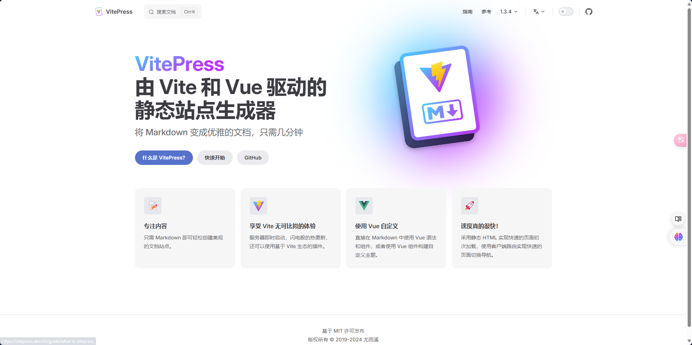
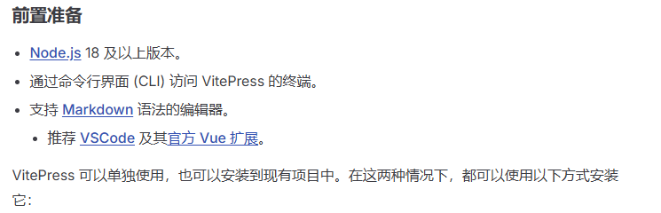
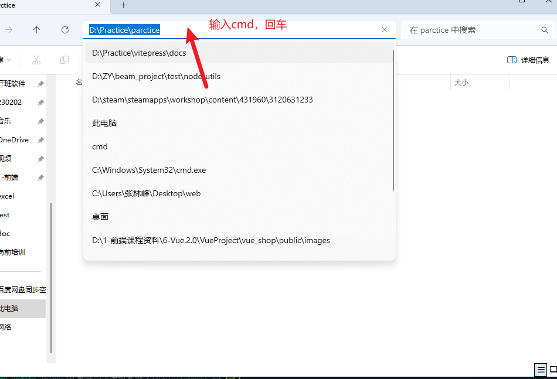
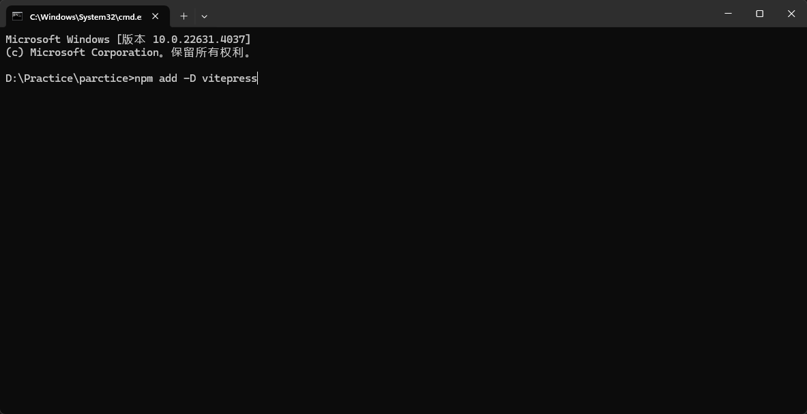
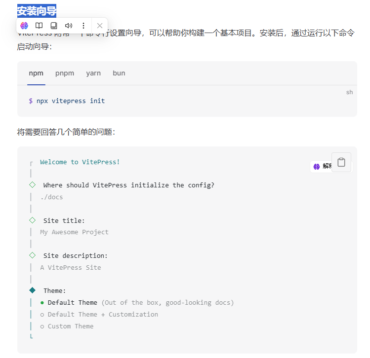
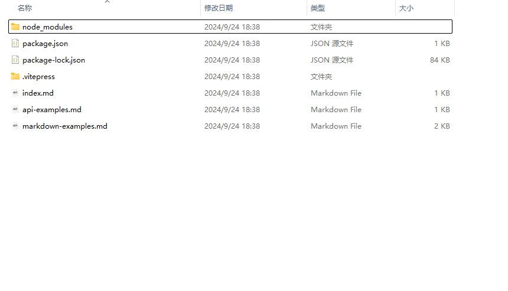

---
next:
    text: "2-购买服务器"
    link: "./2-购买服务器"
---

## 1. <a href="https://vitepress.dev/zh/guide/getting-started" target="_blank">浏览 vitepress 官网</a>

## 2. 做好前置准备

## 3. 按照官方文档，在电脑上选定好一块风水宝地（目录），唤醒 cmd

-   cv 启动！
    
-   if(node 没有安装) [点击学习 node ](../Node/NodeJS)
-   else(npm 没有安装) [点击学习 npm ](../npm/包管理工具)

## 4. 依据安装向导一步步输入命令

## 5. 这样我们就创建好了 vitepress 项目了

