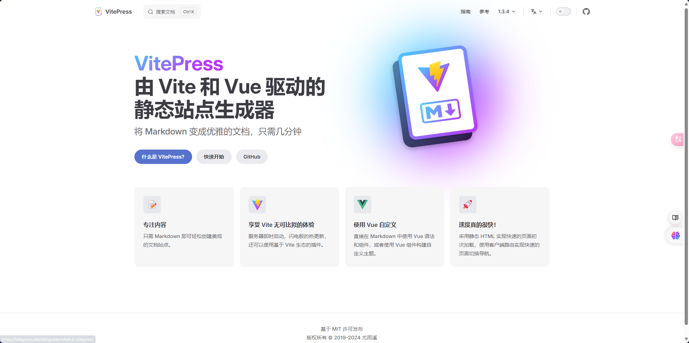
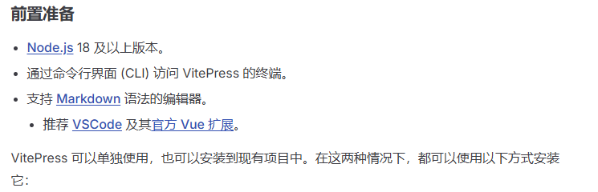
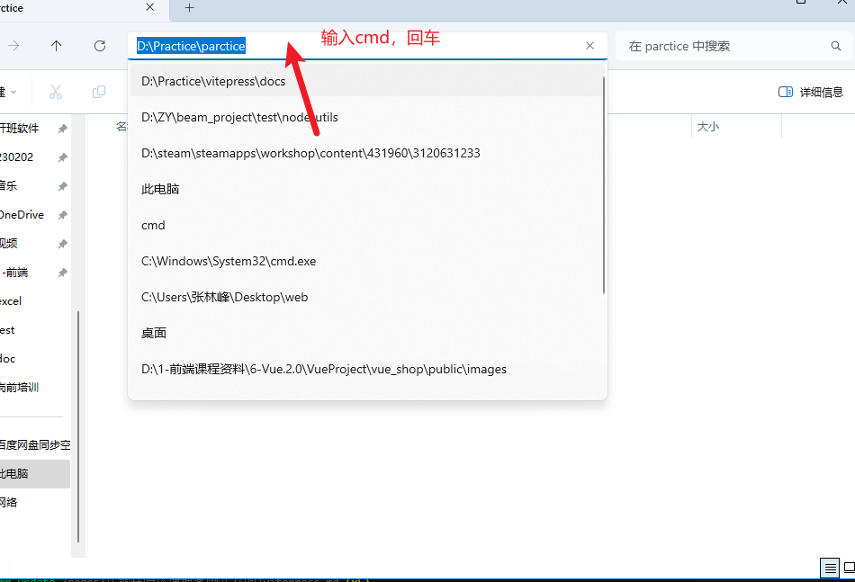
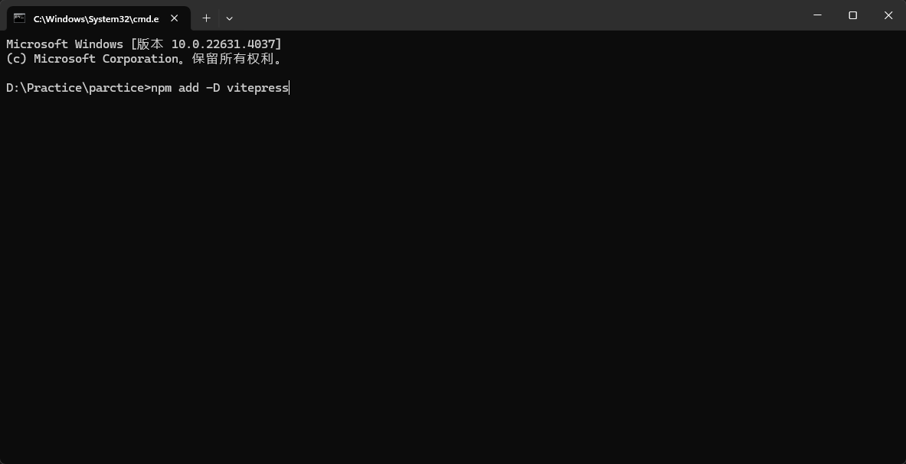
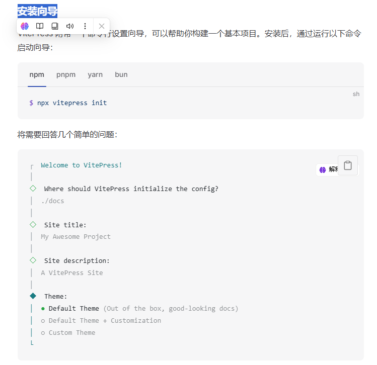
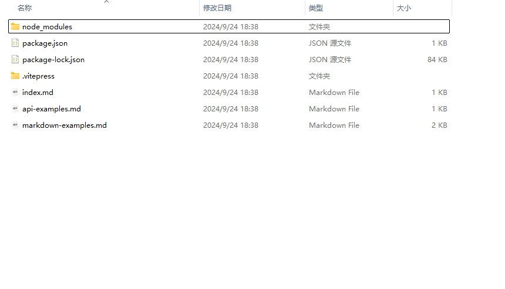

<h1>
<a href="https://vitepress.dev/zh/guide/getting-started" target="_bank">进入 vitepress 官网</a>
</h1>



-   细细品味一番官网的滋味
-   逐渐沉迷
-   猛然惊醒
-   干正事了

1. 做好前置准备
   
2. 按照官方文档，在电脑上选定好一个风水宝地（目录），唤醒 cmd
   

-   cv 启动！
    

```
if(node没有安装){
    失败了？ 看档不看全，运行两行泪
    再看看文档
    前置条件(⊙o⊙)？
    node又是什么东西？
}
```

3. 依据安装向导一步步输入命令
   
4. 锵锵！这样我们就创建好了 vitepress 项目了
   
